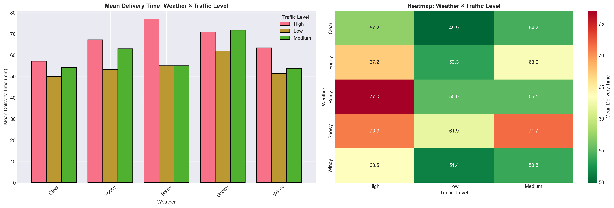

# Exploratory Data Analysis Report

## Executive Summary

### Context
Complaints about late deliveries are rising across our cities. This hurts customer trust, increases support costs, and risks churn. Our goal is to *(1) find the main causes*, *(2) deploy a reliable ETA (estimated time of arrival)*, and *(3) give Operations clear actions to improve on-time delivery*.

### What we learned
- `Distance drives time.` Longer trips take longer—small distance underestimates ripple into missed ETAs.
- `Road conditions matter.` Heavy traffic and bad weather (rain, wind, snow) add predictable delays.
- `Kitchen prep is a secondary lever.` It affects time, but less than distance/road conditions.
- `A few extreme cases exist.` Rare, very long deliveries happen when long routes meet bad traffic or weather.
- `City patterns may differ.` We should calibrate by city/zone rather than assume one size fits all.

### What we can build
- ETA v1 embedded in the order flow that uses trip distance, live traffic, current/forecasted weather, and restaurant prep signals.
- Each order gets: ETA, a simple confidence range, and a “late-risk” flag to drive decisions and customer comms.

### What Ops can do now
- **Tighten dispatch radius in bad conditions**

    Objective: Improve on-time % without broadly slowing quotes.
    How: In heavy traffic/adverse weather, limit long-distance orders; relax when conditions improve.
- **Rethink batching & routing**
    Objective: Reduce late orders on high-risk trips.
    How: Prefer single-drop for long routes during congestion; batch only short, nearby orders.
- **Stabilize prep at the restaurant**
    bjective: Lower variability and support contacts.
    How: Share prep benchmarks; pilot “ready-by” confirmations with recurring outliers.
- **Proactive customer communication**
    Objective: Cut “Where is my order?” contacts and improve CSAT.
    How: If an order is flagged high-risk, add a small ETA buffer and send an early “running late” heads-up; offer targeted make-goods on the top 5% most delayed.
- **City-by-city calibration**
    Objective: Keep accuracy high as we scale.
    How: Review performance weekly by city/zone; adjust radius rules, batching, and buffers based on local results.

###  Recommended Success metrics (weekly)
- **Reliability:** % delivered within quoted ETA; 75th/90th-percentile error.
- **Customer:** Late-promise rate, support contact rate, CSAT/NPS on delayed orders, cancellations/refunds.
- **Ops/Efficiency:** Average dispatch radius, batching %, reassignments, courier utilization.

### Business impact we expect
Fewer broken promises in tough conditions, lower support volume, higher satisfaction—without broadly inflating quoted times. This balances customer trust and operational efficiency while giving teams clear levers to pull every day.

---

## Dataset Overview & Quality

### Dataset Source
[Food Delivery Time Prediction 🛵](https://www.kaggle.com/datasets/denkuznetz/food-delivery-time-prediction/)

### Shape
- 1000 Rows
- 9 Columns

### Informatiom of Variables

**Order_ID:** Unique identifier for each order.

**Distance_km:** The delivery distance in kilometers.

**Weather:** Weather conditions during the delivery, including Clear, Rainy, Snowy, Foggy, and Windy.

**Traffic_Level:** Traffic conditions categorized as Low, Medium, or High.

**Time_of_Day:** The time when the delivery took place, categorized as Morning, Afternoon, Evening, or Night.

**Vehicle_Type:** Type of vehicle used for delivery, including Bike, Scooter, and Car.

**Preparation_Time_min:** The time required to prepare the order, measured in minutes.

**Courier_Experience_yrs:** Experience of the courier in years.

**Delivery_Time_min:** The total delivery time in minutes (target variable).

### Missingness

Missingness looks random/sparse, not concentrated in particular orders. There is no evidence of the target variable missing and there isn't an structured pattern in the missing data.

### Duplicates
No Duplicates found on the Dataset.

### Numerical Variables Distribution

Trips are shown to range widely as observable on the **Distance** distribution graphs, preparation time is also shown to be variate but not extreme. There is a significant frequency of **0** on **Courier Experience**, showing it to be a valid value to use on prediction, representing *novice couriers*.

### Categorical Variables Distribution
There is a solid amount of adverse weather samples for analysis. **High Traffic** seems to be less frequent in the dataset vs. **Medium/Low**. **Bikes are a far bigger portion of the vehicle samples.

### Target Distribution

- The distribution is slightly right-skewed (positively skewed). Most deliveries cluster around 40–60 minutes, but there’s a tail extending beyond 100 minutes, indicating a minority of long delivery times. The KDE and violin plots confirm this, showing the right tail is heavier, suggesting some deliveries took unusually long (possible traffic, weather, or preparation delays).
- With a Mean of **~56.7 min** and a Median of **~55.5 min**, we can observe that the skew is mild.
- The IQR (Interquartile Range) appears moderate, covering roughly 40–70 minutes. There are notable outliers above 120 minutes — these represent exceptionally long deliveries that could be operational anomalies. The lower bound (min values) doesn’t show severe outliers, implying that early or fast deliveries are rare but within reasonable range.
- The Q–Q plot deviates upward in the right tail, confirming that the data is not perfectly normal due to long-tail behavior.The main body aligns fairly well with the normal line, so transformations (like log-scaling) might help if normality is required for modeling
- Around 80% of deliveries occur below ~80 minutes. The curve flattens after 100 minutes, again emphasizing that long deliveries are outliers, not the norm.

### Key Patterns

#### Distance is the primary driver
 `Distance_km and Delivery_Time_min` graph shows a strong, monotonic relationship between both variables. Which can be read by the business reading as small underestimates of distance on long routes create outsized ETA misses, and highlighting distance as the most influential variable which affect delivery time.

 #### Kitchen prep matters, but is a secondary lever
Preparation_Time_min has a smaller, consistent positive relationship with delivery time. Standardizing prep coukd help, but gains are smaller than improving distance/route/conditions.

#### Road conditions materially shift times
**High** traffic increases average delivery time meaningfully vs. **Low** and **Medium**. Also adverse conditions add predictable minutes to the delivery time.

#### Multicollinearity & feature hygiene
No problematic high correlations among the features; distance is the only strongly target-aligned variable. Safe to proceed with simple baselines and tree models without heavy regularization gymnastics.

### Assumptions & Data Decisions

- Imputation is reasonable given low missingness (mode for categorical, median for numeric).
- Zeros in experience are real novices, not missing data codes.
- Outliers are genuine operational cases; retained to preserve tail risk signals.
- Region effects: With no explicit region field, current results assume broadly similar dynamics across cities. We will calibrate by city/zone during rollout.
- Prediction-time availability: Distance, traffic, weather, and prep signals are known or forecastable at order time (no leakage).
- Non-normality tolerated: We use robust metrics (e.g., MAE, p75/p90 error) and models resilient to skew and heteroskedasticity (prediction errors in the data getting bigger or smaller depending on the size of something else, instead of staying evenly spread out).