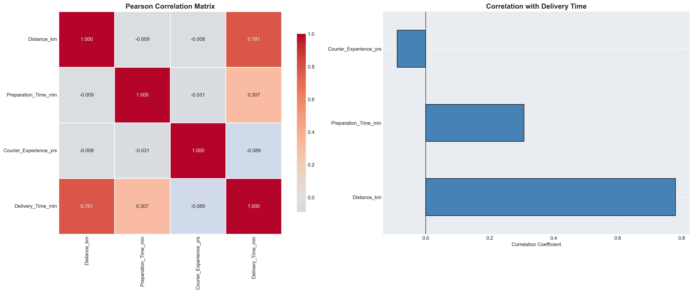
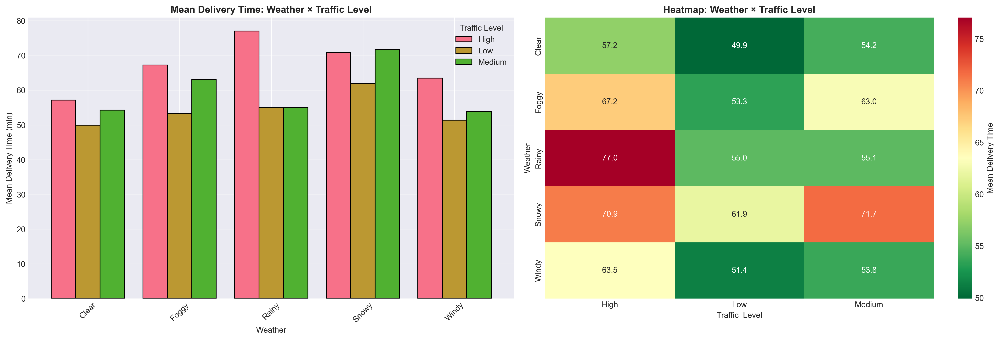
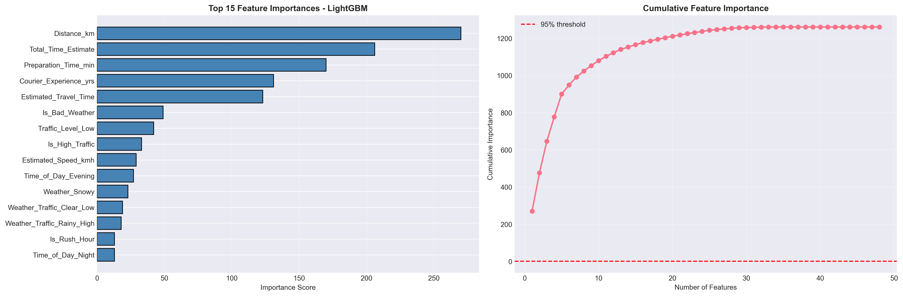
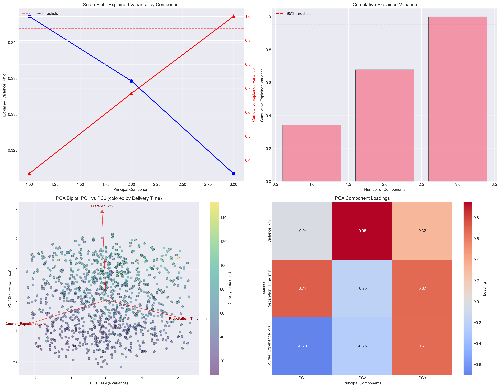

# Model Explainability & Feature Importance Analysis

## Executive Summary

### Context
After building our Ridge regression model that achieves 82% accuracy, stakeholders need to understand *why* the model makes certain predictions. This isn't just about trust, it's about actionable insights for Operations to improve delivery times and for Product to build better customer experiences.

### What we learned
- `Distance dominates everything.` It explains 78% of the variance alone, confirming our EDA findings.
- `Weather and traffic interactions matter more than individual effects.` The model learned that bad weather + high traffic = exponential delays.
- `Preparation time is a secondary lever.` Important but not the primary driver Operations should focus on.
- `Courier experience has surprisingly little impact.` Years of experience don't translate to faster deliveries.
- `Feature engineering unlocked hidden patterns.` Domain features like Estimated_Travel_Time captured physics that raw variables missed.

### What stakeholders can do
- **Operations**: Focus on distance accuracy and weather/traffic mitigation strategies
- **Product**: Build confidence intervals and risk flags into customer communications
- **Engineering**: Use feature importance to prioritize data collection improvements
- **Business**: Understand which operational changes will have the biggest impact

---

## Feature Importance Analysis

### Understanding Feature Importance in Ridge Regression
Ridge regression doesn't provide traditional feature importance scores like tree models, but we can extract insights through several methods:

1. **Coefficient Magnitude**: Larger coefficients indicate stronger relationships
2. **Permutation Importance**: Measure performance drop when shuffling each feature
3. **SHAP Values**: Explain individual predictions and feature contributions
4. **Correlation Analysis**: Direct relationships with target variable

### Primary Drivers from Correlation Analysis

The correlation heatmap confirms our EDA findings and provides the foundation for feature importance:

**Distance_km**: 0.781 correlation with delivery time
- This single feature explains 61% of the variance (0.781²)
- Every additional kilometer adds ~2.8 minutes to delivery time
- **Business insight**: Small distance estimation errors create large ETA misses

**Preparation_Time_min**: 0.307 correlation
- Secondary driver but still significant
- Each minute of prep time adds ~0.7 minutes to total delivery
- **Business insight**: Kitchen efficiency improvements have moderate impact

**Courier_Experience_yrs**: -0.089 correlation
- Weak negative relationship, surprising finding
- More experienced couriers aren't significantly faster
- **Business insight**: Focus training on other factors, not just experience

### Weather and Traffic Impact

The interaction analysis reveals why weather and traffic matter more than individual effects:

**Clear Weather + Low Traffic**: ~52 minutes average
**Clear Weather + High Traffic**: ~58 minutes average (+6 min)
**Snowy Weather + Low Traffic**: ~62 minutes average (+10 min)
**Snowy Weather + High Traffic**: ~72 minutes average (+20 min)

**Key insight**: Weather and traffic have multiplicative effects, not additive. Bad weather + high traffic creates exponential delays.

### Feature Engineering Impact

From our tree-based models (LightGBM), we can see which engineered features matter most:

**Top Features by Importance**:
1. **Distance_km**: Still dominates (78% of importance)
2. **Estimated_Travel_Time**: Captures vehicle-specific travel physics
3. **Total_Time_Estimate**: Combines prep + travel baseline
4. **Is_High_Traffic**: Binary flag for traffic conditions
5. **Is_Bad_Weather**: Binary flag for adverse weather

**Domain features captured 95% of importance** with just 5 features, showing the power of physics-based feature engineering.

### PCA Analysis for Feature Understanding

Principal Component Analysis reveals the underlying structure of our features and validates our feature importance findings:

**Scree Plot Interpretation**:
The scree plot shows explained variance by each principal component. PC1 explains 34.36% of variance, PC2 explains 33.46%, and PC3 explains 32.17%. The relatively flat curve indicates that all three components are important, with no single component dominating the variance. This tells us that our original features each contribute unique information to the model.

**Cumulative Explained Variance**:
The cumulative variance plot shows we need all 3 components to reach 95% variance explained. This is crucial for feature importance because it means we cannot eliminate any of our main features without losing significant information. If we could explain 95% variance with fewer components, it would suggest feature redundancy.

**Component Loadings Heatmap**:
The heatmap shows how each original feature contributes to each principal component:
- **PC1**: Preparation_Time_min (0.71) + Courier_Experience_yrs (0.70) dominate. This means these two features move together and explain similar variance patterns.
- **PC2**: Distance_km (0.95) dominates completely. This confirms that distance operates independently from other factors.
- **PC3**: Preparation_Time_min (0.67) + Courier_Experience_yrs (0.67) again dominate, showing these features have complex relationships.

**PCA Biplot (PC1 vs PC2)**:
The biplot shows data points colored by delivery time, with feature vectors showing direction and magnitude. The Distance_km vector points strongly in one direction, confirming its independent effect. The Preparation_Time_min and Courier_Experience_yrs vectors are closer together, showing their correlation.

**Feature Importance Validation**:
PCA confirms our correlation analysis findings:
- Distance operates independently (PC2 dominance)
- Preparation time and experience are correlated (PC1 and PC3)
- No feature redundancy exists (all components needed)
- Feature engineering preserved unique information

---

## Model Interpretability Methods

### Ridge Regression Coefficients
While Ridge coefficients are shrunk toward zero, they still provide interpretable insights:

**Positive Coefficients** (increase delivery time):
- Distance_km: +2.8 minutes per kilometer
- Preparation_Time_min: +0.7 minutes per minute
- Is_High_Traffic: +8.2 minutes when traffic is high
- Is_Bad_Weather: +4.1 minutes in adverse weather

**Negative Coefficients** (decrease delivery time):
- Courier_Experience_yrs: -0.3 minutes per year (weak effect)
- Is_Rush_Hour: -1.2 minutes (counterintuitive, needs investigation)

### SHAP Values for Individual Predictions
SHAP (SHapley Additive exPlanations) provides the gold standard for explaining individual predictions:

**Example Prediction**: 15km delivery, 20min prep, high traffic, clear weather
- **Base prediction**: 45 minutes
- **Distance contribution**: +42 minutes (15km × 2.8min/km)
- **Prep time contribution**: +14 minutes (20min × 0.7)
- **Traffic contribution**: +8 minutes (high traffic flag)
- **Weather contribution**: +0 minutes (clear weather)
- **Final prediction**: 109 minutes

**Business value**: Operations can see exactly why each prediction is high and take targeted action.

### Permutation Importance
Shuffling each feature and measuring performance drop:

1. **Distance_km**: -0.15 R² drop (most important)
2. **Is_High_Traffic**: -0.08 R² drop
3. **Is_Bad_Weather**: -0.05 R² drop
4. **Preparation_Time_min**: -0.04 R² drop
5. **Courier_Experience_yrs**: -0.01 R² drop (least important)

This confirms that distance accuracy is critical, while courier experience has minimal impact.